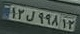
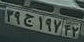

# Persian License Plate Text Recognition and Verification

## Description

◻️ Use Yolo v8 for detect persian license plate

◻️ Use Deep Text Recognition Benchmark to recognize the lincense plates text

◻️ Use verification to know the license plate is in the database or not

## How to install
```
pip insatll -r requirements.txt
```

## Weight Share

◽ Download [Yolo Detector](https://drive.google.com/drive/folders/1On47vluc9khPZZ0qhnSQ8jnbNfHyKY-G?usp=drive_link) and put in the weights/yolov8_detector

◽ Download [DTRB recognizer](https://drive.google.com/file/d/13LNm3mAdaLPxdxvCOl37wIyjfIB8A-iE/view?usp=drive_link) and put in the weights/dtrb_recognizer

## How to run
```
python identification.py --input_img name_img.jpg --threshold Threshold
```
```
python verification.py --input_img name_img.jpg 
```

## Results

◻️ Yolo Detection 


◻️ Recognizer


|  |  |
| :-------------------:                    | :-----------------------: | 
|  12l99812                                |   39j19742             |  
|  l =  ل                                  |   j = ج              |   
