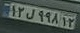
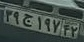

# PiPLine Persian License Plate Text Recognition with using Deep Text Recognition Benchmark 

## Description

◻️ Use Yolo v8 for detect persian license plate

◻️ Use [deep-text-recognition-benchmark]([(https://github.com/clovaai/deep-text-recognition-benchmark)https://github.com/clovaai/deep-text-recognition-benchmark])
repository  to recognize persian license plate text

◻️ Weights

◽ [Yolo Detector](https://drive.google.com/file/d/1x4gBpO1N63c2-raWuGgiWSafjQ1PabAn/view?usp=drive_link)

◽ [DTRB recognizer](https://drive.google.com/file/d/13LNm3mAdaLPxdxvCOl37wIyjfIB8A-iE/view?usp=drive_link)

## How to install
```
pip insatll -r requirements.txt
```

## How to run
```
python main.py --Transformation TPS --FeatureExtraction ResNet --SequenceModeling BiLSTM --Prediction Attn
```

## Results

◻️ Yolo Detection 


◻️ Recognizer


|  |  |
| :-------------------:                    | :-----------------------: | 
|  12l99812                                |   39j19742             |  
|  l =  ل                                  |   j = ج              |   
